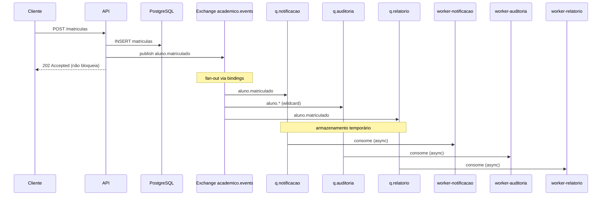
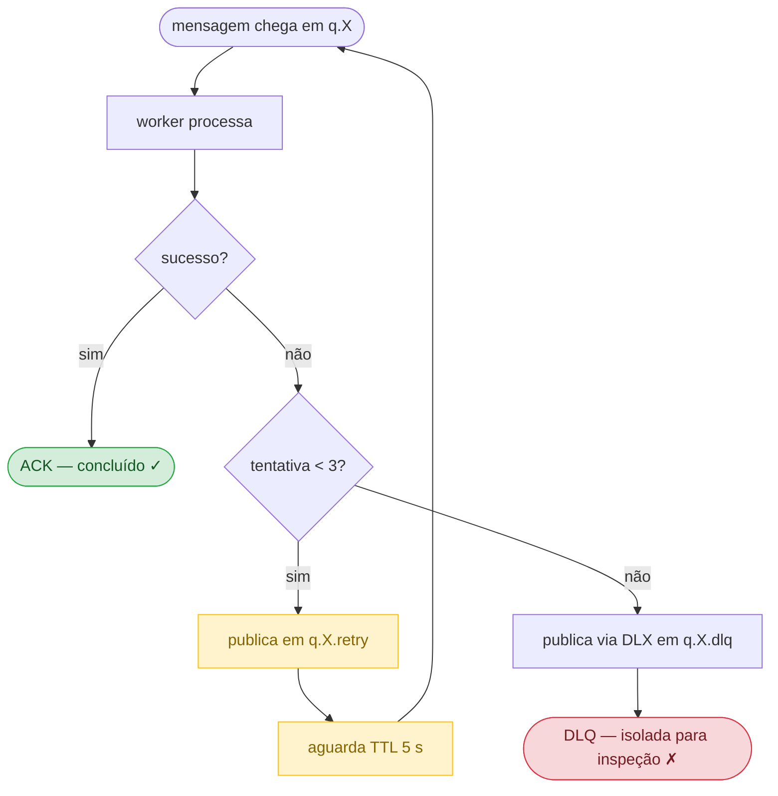

# Plataforma Acadêmica — Pub/Sub com RabbitMQ

Arquitetura orientada a eventos para o trabalho de Arquitetura de Software.
Um único evento de negócio (cadastro ou matrícula) é **publicado** e o broker
faz **fan-out** para vários assinantes independentes — notificação, auditoria e
relatório — cada um com sua própria fila, retry e DLQ.

## Por que RabbitMQ (pub/sub de broker)

O cenário é fan-out: um produtor, vários consumidores. Um broker resolve isso
**no nível da infraestrutura** — o assinante se registra via *binding* e o
produtor publica um evento sem saber quem consome. Adicionar um novo assinante
não exige tocar no produtor. É o pub/sub "de verdade", diferente de um fan-out
feito em código de aplicação.

Usamos um exchange `topic`, que ainda permite **roteamento seletivo**: cada
assinante escolhe quais eventos quer ouvir através de routing keys.

## Stack

| Camada          | Tecnologia                         |
|-----------------|------------------------------------|
| Broker          | RabbitMQ (exchange topic + DLX)    |
| Produtor / API  | Node.js + Express                  |
| Consumidores    | Node.js + amqplib (3 assinantes)   |
| Banco           | PostgreSQL                         |
| Observabilidade | Prometheus + Grafana               |
| Orquestração    | Docker Compose                     |

## Arquitetura

### Fluxo principal — pub/sub com fan-out e roteamento seletivo

O diagrama mostra uma matrícula: **um único evento** chega ao exchange e o
broker faz fan-out para os três assinantes. A API já respondeu `202 Accepted`
antes de qualquer worker processar.



> Para `aluno.cadastrado`, apenas `q.notificacao` e `q.auditoria` recebem —
> `q.relatorio` não tem binding para esse evento. Quem decide é o broker.

### Ciclo de vida de uma mensagem — retry e DLQ

Cada assinante tem o seu próprio ciclo. Uma falha em `q.relatorio` não afeta
`q.notificacao` nem `q.auditoria`.



> Detalhe importante: o retry devolve a mensagem **direto para `q.X`** via
> `RETRY_EXCHANGE` (exchange direct), não para o exchange topic. Isso impede que
> o fan-out se repita e os "irmãos" reprocessem a mesma mensagem.

### Roteamento (bindings)

| Assinante     | Routing keys                            | Reage a              |
|---------------|-----------------------------------------|----------------------|
| notificacao   | `aluno.cadastrado`, `aluno.matriculado` | cadastro e matrícula |
| auditoria     | `aluno.*`                               | tudo (wildcard)      |
| relatorio     | `aluno.matriculado`                     | só matrícula         |

## Como rodar

```bash
docker compose up --build
```

| Serviço            | URL                     | Credenciais   |
|--------------------|-------------------------|---------------|
| API                | http://localhost:3000   | —             |
| RabbitMQ (painel)  | http://localhost:15672  | guest / guest |
| Prometheus         | http://localhost:9090   | —             |
| Grafana            | http://localhost:3001   | admin / admin |

## Endpoints

```bash
# Cadastro -> evento aluno.cadastrado (notificacao + auditoria reagem)
curl -X POST http://localhost:3000/alunos \
  -H "Content-Type: application/json" \
  -d '{"nome":"Ana Souza","email":"ana@puc.br"}'

# Matricula -> evento aluno.matriculado (os TRES reagem)
curl -X POST http://localhost:3000/matriculas \
  -H "Content-Type: application/json" \
  -d '{"alunoId":1,"curso":"Engenharia de Software"}'

# Forca falha em UM assinante (demo de retry/DLQ isolado)
curl -X POST http://localhost:3000/matriculas \
  -H "Content-Type: application/json" \
  -d '{"alunoId":1,"curso":"ES","falharEm":"relatorio"}'
```

---

## Roteiro da apresentação (mapeado aos requisitos)

### 1. Publicação de mensagens
POST em `/alunos`. A API responde **202 Accepted** e publica um evento no
exchange. No painel (aba *Exchanges* → `academico.events`) vê-se a taxa de
publicação.

### 2. Consumo assíncrono
Logs dos 3 workers mostram o processamento em segundo plano, sem o cliente
esperar.

### 3. Fila / tópico recebendo mensagens — e FAN-OUT
Aba *Queues* do painel: um POST em `/alunos` faz **duas** filas receberem
(`q.notificacao`, `q.auditoria`); um POST em `/matriculas` faz **as três**
receberem. Esse é o fan-out, visível ao vivo.

### 3b. Roteamento seletivo (diferencial do broker)
Mostre que `q.relatorio` **não** recebe o `aluno.cadastrado` — só matrícula.
Quem decide isso é o binding no broker, não o produtor.

### 4. Comportamento com um consumidor indisponível
```bash
docker compose stop worker-relatorio
# gere matriculas:
for i in $(seq 1 5); do curl -s -X POST http://localhost:3000/matriculas \
  -H "Content-Type: application/json" \
  -d '{"alunoId":1,"curso":"ES"}'; done
```
`q.relatorio` **acumula** em *Ready* enquanto notificação e auditoria seguem
normais — desacoplamento entre assinantes. Religue e veja drenar:
```bash
docker compose start worker-relatorio
```

### 5. Reprocessamento / retry
POST com `"falharEm":"relatorio"`. O log mostra `retry 1/2`, `retry 2/2`; a
mensagem passa por `q.relatorio.retry` (TTL 5s) e volta **só** para
`q.relatorio` — sem reprocessar nos outros assinantes.

### 6. Dead Letter Queue
Após 3 tentativas, a mensagem cai em `q.relatorio.dlq`, isolada, sem afetar as
demais filas. Cada assinante tem a sua DLQ.

### 7. Tempo entre publicação e processamento
Cada evento carrega `publishedAt`; cada worker registra a latência no histograma
`latencia_publicacao_processamento_segundos{consumidor=...}`. No **Grafana**,
o painel mostra p95 por consumidor.

### 8. Consistência eventual e falhas — pontos para discutir
- **Consistência eventual:** o dado é gravado na hora; as reações acontecem
  depois e em ritmos diferentes (relatório demora mais que notificação).
- **At-least-once / idempotência:** com retry, um evento pode ser processado
  mais de uma vez — consumidores devem ser idempotentes.
- **Detalhe fino do retry:** a fila de retry devolve a mensagem para o exchange
  *direto* do assinante (não para o topic), senão o fan-out se repetiria e os
  "irmãos" reprocessariam. Saber explicar isso mostra domínio do broker.
- **Dual-write:** API grava no Postgres e publica no broker em dois passos.
  Evolução: padrão **Outbox**.
- **Pub/sub vs. fila:** a fila sozinha resolveria "um produtor, um consumidor";
  o exchange topic é o que permite fan-out + roteamento seletivo de forma
  declarativa no broker.

---

## Mapa dos arquivos

```
plataforma-pubsub/
├── docker-compose.yml          # rabbitmq, postgres, api, 3 workers, prom, grafana
├── api/                        # produtor
│   └── src/
│       ├── index.js            # POST /alunos e /matriculas
│       ├── rabbit.js           # conexão e publicação no exchange
│       ├── topology.js         # exchanges, filas, bindings, retry, DLQ
│       ├── db.js               # PostgreSQL
│       └── metrics.js
├── worker/                     # consumidor genérico (CONSUMER define o papel)
│   └── src/
│       ├── index.js            # consumo + retry + DLQ por assinante
│       ├── handlers.js         # o que cada assinante faz
│       ├── topology.js         # (igual ao da API)
│       └── metrics.js          # métricas com label {consumidor}
├── db/init.sql
└── observability/
    ├── prometheus.yml
    └── grafana/provisioning/   # datasource + dashboard prontos
```
